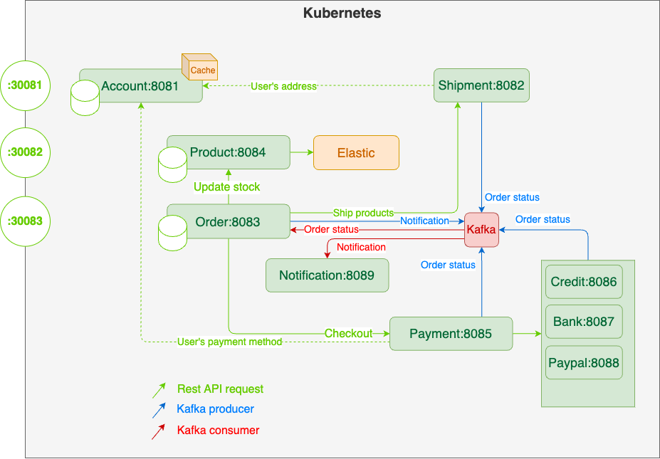

# Team members
- Saintur Batkhuu
- Samreth Kem
- Sumayya Jahan
- Yumjirdulam Chinbat

🛡 - Protected API (with authentication)

🌐 - Public API

🔒 - Internal API (service to service protection)

# Structure



### Account service : 8081

    Responsible for authenticating user. 
    Store following information:
        Full name, email, username, password, roles
        Preferred payment

#### APIs
```
🌐 /api/uaa/authenticate [POST] {username, password}
🌐 /api/uaa/register [POST] {username, email, firstname, lastname, password}
🛡 /api/uaa/logout [DELETE]
🛡 /api/uaa/check [GET]
🛡 /api/users [CRUD] (only user with role ADMIN can access)
🛡 /api/payment-method [POST] create or update payment mehtod
🛡 /api/shipping-address [POST] create or update shipping address
🛡 /api/payment-method [GET] get user's payment mehtod
🛡 /api/shipping-address [GET] get user's shipping address
```

### Shipment service : 8082

    Shipment service stores address of user.
    Shipment has following API:
        Ship: find user's shipping address and ship it
        Set address: create address according to userId
        Update address: update address according to userId
    userId is store in the token
#### APIs
```
🔒 /api/ship/{orderNumber} [POST] body: address
```
### Order service : 8083
    
    Order service responsible for storing a cart items,
    Order service will make sure stock exceeding issue,
    This service also connects to shipment service to ship items to user's home
#### APIs
```
🛡 /api/orders/my [GET] user see their own orders
🛡 /api/orders/my/{orderNumber} [GET] user see their own order by order number
🛡 /api/orders/activities/{orderNumber} [GET] order activities by order number
🛡 /api/orders/place-order [POST] to place order
🔒 /api/orders/update-status/{orderNumber}/{status} [PUT] change status (only internal service will access to this)
```
### Product service : 8084
    
    Product service stores all the product information.
    We used batch processing to insert 1000 fake data to DB.
#### APIs
```
🛡 /api/products [CRUD] query parameters will filter products
🌐 /api/search [GET] query parameters {name, description, category, price.lessThan, price.greaterThan}
🔒 /api/products/{id}/reduce-stocks/{count} [PUT] reduce stock when user orders products (only internal service will access to this)
🔒 /api/products/{id}/availablility/{count} [GET] reduce stock when user orders products (only internal service will access to this)
```
### Payment service : 8085

    Decides which payment service to call according to 
    user's preferred payment method 

    (We will store it inside the token)
#### APIs
```
🔒 /api/checkout [POST]
```
### Credit service : 8086
#### APIs
```
🔒 /api/pay [POST] cardNumber, cardExpires, cardSecurityCode required
```
### Bank service : 8087
#### APIs
```
🔒 /api/pay [POST] bankName, bankAccount, routingNumber required
```
### Paypal service : 8088
#### APIs
```
🔒 /api/pay [POST] accountNumber, accountToken required
```
