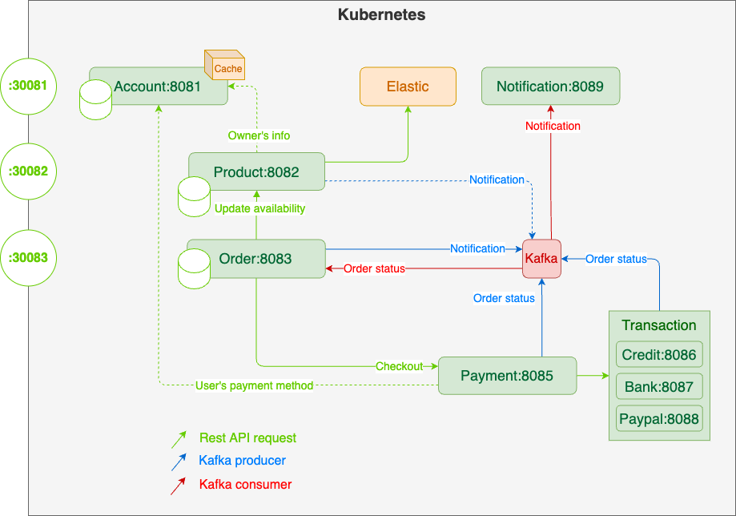

# Team members
- Saintur Batkhuu
- Samreth Kem
- Sumayya Jahan
- Yumjirdulam Chinbat

🛡 - Protected API (with authentication)

🌐 - Public API

# Structure



### Account service : 8081

    Responsible for authenticating user. 
    Store following information:
        Full name, email, username, password, roles
        Preferred payment

#### APIs
```http request
🌐 /api/uaa/authenticate [POST] {username: String, password: String}
🛡 /api/uaa/logout [DELETE]
🛡 /api/uaa/check [GET]
🛡 /api/users [CRUD] (only user with role ADMIN can access)
🛡 /api/profile/payment-method [PUT] body: {preferredMethod: String}
```

### Shipment service : 8082

    Shipment service stores address of user.
    Shipment has following API:
        Ship: find user's shipping address and ship it
        Set address: create address according to userId
        Update address: update address according to userId
    userId is store in the token
#### APIs
```http request
🌐 /api/address/ship [POST] body: empty
🛡 /api/address/shipping [POST] body: Address
🛡 /api/address/shipping/{id} [PUT] body: Address
```
### Order service : 8083
    
    Order service responsible for storing a cart items,
    Order service will make sure stock exceeding issue,
    This service also connects to shipment service to ship items to user's home

### Product service : 8084
    
    Product service stores all the product information.
    We used batch processing to insert 1000 fake data to DB.
#### APIs
```http request
🛡 /api/products [CRUD] query parameters will filter products
🌐 /api/search [GET] query parameters {name, description, category, price.lessThan, price.greaterThan}
🌐 /api/products/{id}/reduce-stocks/{count} [PUT] reduce stock when user orders products
```
### Payment service : 8085

    Decides which payment service to call according to 
    user's preferred payment method 

    (We will store it inside the token)
#### APIs
```http request
🛡 /api/checkout [POST]
```
### Credit service : 8086
#### APIs
```http request
🌐 /api/pay [POST]
```
### Bank service : 8087
#### APIs
```http request
🌐 /api/pay [POST]
```
### Paypal service : 8088
#### APIs
```http request
🌐 /api/pay [POST]
```
